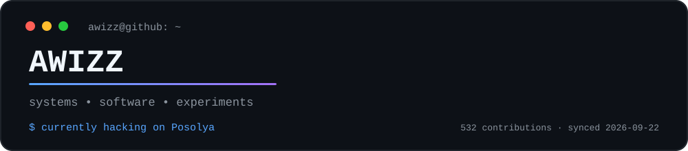
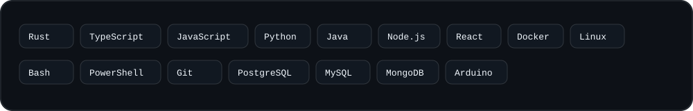
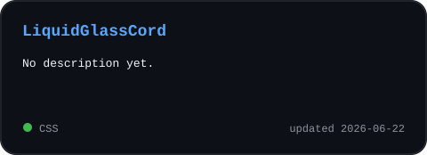
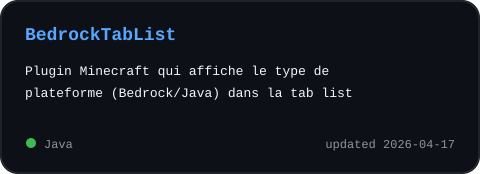
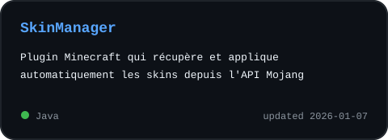
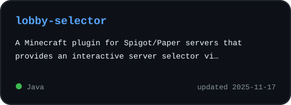
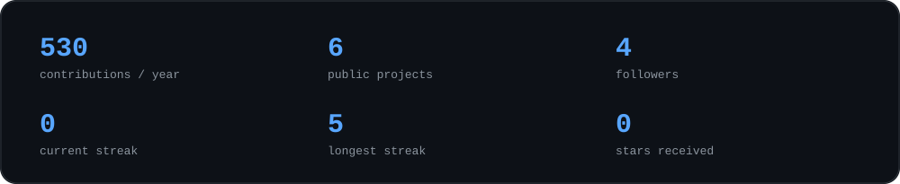
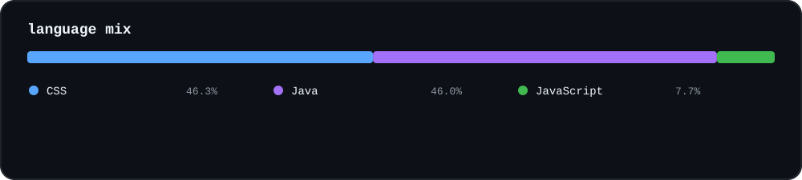
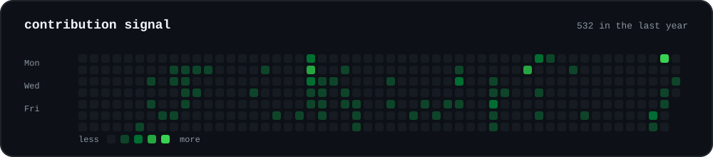

<div align="center">



</div>

## `~/about`

I build tools, bots and systems projects — usually because I wanted something that didn't exist yet.

```text
$ whoami
awizz — building, breaking, learning, rebuilding
```

Current rabbit hole: **Nebula Shell**, a Windows shell written in Rust.

## `~/stack`

<div align="center">
  
</div>

## `~/featured`

<p align="center">
  <a href="https://github.com/awizzz/LiquidGlassCord"></a>
  <a href="https://github.com/awizzz/BedrockTabList"></a>
</p>

<p align="center">
  <a href="https://github.com/awizzz/SkinManager"></a>
  <a href="https://github.com/awizzz/lobby-selector"></a>
</p>

## `~/signal`

<div align="center">
  
  <br /><br />
  
  <br /><br />
  
</div>

## `~/contributions`

<div align="center">
  
</div>

## `~/contact`

<div align="center">
  <a href="mailto:awizz.pro@proton.me"><b>EMAIL</b></a>
  &nbsp;&nbsp;•&nbsp;&nbsp;
  <a href="https://discord.gg/awizzzoff"><b>DISCORD</b></a>
  &nbsp;&nbsp;•&nbsp;&nbsp;
  <a href="https://github.com/awizzz?tab=repositories"><b>ALL REPOSITORIES</b></a>
</div>

<br />

<div align="center">
  <sub>Most projects start because I wanted the thing and couldn't find it.</sub>
</div>
