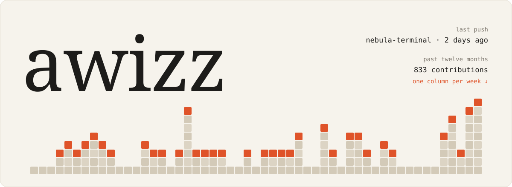
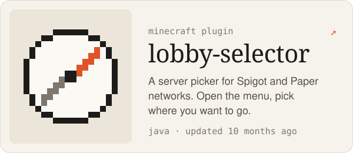
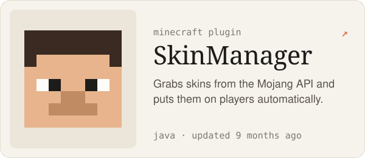
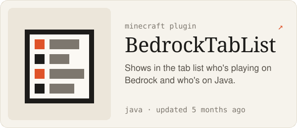
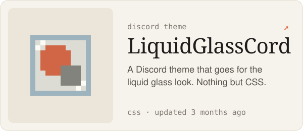

<picture>
  <source media="(prefers-color-scheme: dark)" srcset="./assets/banner-dark.svg">
  
</picture>

I'm **awizz**. Most of what's on this profile exists because I wanted something, went looking for it, and either couldn't find it or didn't like what I found. So I built it, broke it, and built it again once I understood the problem a bit better.

That's how I ended up with a handful of Minecraft plugins, a Discord theme, a few bots, and now a shell.

### Right now

[**Nebula Shell**](https://github.com/awizzz/nebula-terminal), a shell for Windows written in Rust. It's my current rabbit hole and the project I learn the most from.

### Things I've made

  <a href="https://github.com/awizzz/lobby-selector"><picture><source media="(prefers-color-scheme: dark)" srcset="./assets/card-lobby-selector-dark.svg"></picture></a>
  <a href="https://github.com/awizzz/SkinManager"><picture><source media="(prefers-color-scheme: dark)" srcset="./assets/card-SkinManager-dark.svg"></picture></a>
  <a href="https://github.com/awizzz/BedrockTabList"><picture><source media="(prefers-color-scheme: dark)" srcset="./assets/card-BedrockTabList-dark.svg"></picture></a>
  <a href="https://github.com/awizzz/LiquidGlassCord"><picture><source media="(prefers-color-scheme: dark)" srcset="./assets/card-LiquidGlassCord-dark.svg"></picture></a>

Everything else is in [my repositories](https://github.com/awizzz?tab=repositories), half-finished experiments included.

### What I work with

TypeScript and Java most of the time, Rust for Nebula. Python, Bash and PowerShell for the small scripts that glue everything together. Node and React when a project needs a web side, PostgreSQL, MySQL or MongoDB depending on the data, Docker to run it all on Linux. And an Arduino when I feel like touching actual hardware.

### Talk to me

Found a bug in one of my plugins, have an idea, or just want to chat: [email](mailto:awizz.pro@proton.me) works, and so does [my Discord server](https://discord.gg/awizzzoff). Issues and PRs are welcome on any repo.
